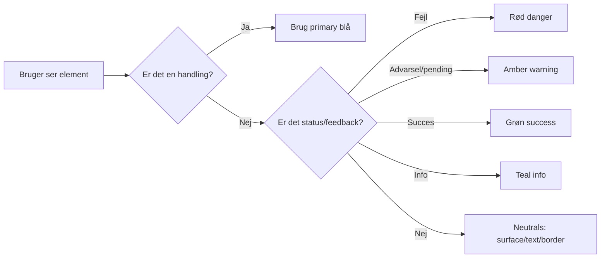

# Evidensbaseret farvesystem til Green AI

## Executive summary

Green AI bør bruge et **rollebaseret farvesystem** (tokens + farveroller) fremfor “brandfarver overalt”. Det er den mest robuste måde at skabe et **roligt, enterprise-grade workspace** med **kommunal tilgængelighed** (WCAG/EN 301 549) og lav “cognitive load”. W3C’s WCAG kræver typisk **≥ 4.5:1** for normal tekst (AA) og **≥ 3:1** for ikke-tekst UI-komponenters visuelle afgrænsning (AA), og farver må ikke være eneste signal for betydning. citeturn0search0turn0search1turn2search1

Den stærkeste evidens for langvarig brug og læsbarhed peger på:  
- **Positive polarity** (mørk tekst på lys baggrund) giver bedre korrekturlæsning/ydelse—særligt ved små tegnstørrelser—end “omvendt” polarity. citeturn8view1  
- **Høj luminanskontrast** mellem tekst og baggrund øger læsbarhed; Hall & Hanna (2004) finder generelt, at større kontrast giver større læsbarhed, og at sort på hvid typisk vurderes mest læsbart. citeturn10view0  
- Store design systems anbefaler at bruge **neutrale overflader** til hierarchy, og at bruge **semantiske farver sparsomt** til status/urgency (ikke dekoration). Dette er eksplicit i Fluent 2. citeturn6view2turn11view3  

**Konklusion:** Flyt Green AI væk fra “meget rødt” og over i et system hvor:
- **Blå = handling og navigation (primary)**  
- **Rød = kun fejl/critical**  
- **Grøn = success**  
- **Orange/amber = warning/pending**  
- **Teal = info/neutral status**  
- **Neutrale grå/offwhite = alt andet (surfaces, tekst, borders)**  

Nedenfor får du: (1) forsknings-/industrisyntese, (2) konkrete paletteroller, (3) en tokeniseret palette med **beregnede kontrastforhold**, (4) mapping til UI-elementer, (5) color-blind-safe strategier og tests, (6) MudBlazor + CSS-implementering, (7) automatiske test gates.

image_group{"layout":"carousel","aspect_ratio":"16:9","query":["Fluent 2 design system color palette neutral shared brand screenshot","Material Design 3 color roles primary secondary tertiary surface outline diagram","GOV.UK design system colour palette focus yellow screenshot","USWDS design tokens color overview screenshot"],"num_per_query":1}

## Evidens og best practice om farver i produktivitetsværktøjer

**Læsbarhed og “long-duration use” (HCI-evidens)**  
Studier om skærm-læsning viser konsekvent en “positive polarity advantage” i mange opgaver: mørk tekst på lys baggrund kan give bedre performance end lys tekst på mørk baggrund—og effekten bliver vigtigere når tekst bliver lille. citeturn8view1  
Hall & Hanna (2004) viser, at farvekombinationer med højere kontrast generelt giver højere oplevet læsbarhed, og at sort på hvid vurderes mest læsbart blandt deres testede kombinationer. citeturn10view0  
NHS’ designmanual anbefaler en **let baggrundstint** fremfor helt hvid, bl.a. for at reducere glare og få vigtige komponenter til at stå tydeligere frem. citeturn6view4  

**Farvers betydning og “color psychology” (hvad man kan bruge—og hvad man skal være varsom med)**  
En højt citeret reviewartikel i *Annual Review of Psychology* konkluderer, at farver kan bære mening og påvirke affekt/kognition/adfærd—men at forskningens anvendelsesrekommendationer skal håndteres med forsigtighed pga. boundary conditions og generaliserbarhed. citeturn9view0  
Derfor bør Green AI bygge sin farvestrategi primært på:
- WCAG-kontrast og læsbarhed (hård evidens og klare thresholds) citeturn0search0turn0search1  
- Konsistente farveroller og semantiske tokens (driftssikkerhed) citeturn11view3turn6view2  
- “Don’t rely on color alone” (kommunal tilgængelighed + color vision deficiency) citeturn2search1turn11view0  

**Industrisyntese: hvorfor farveroller slår “palette-frihed”**  
Fluent 2 beskriver eksplicit, at neutrale farver (sort/hvid/grå) er fundamentet for surfaces og tekst, og at semantiske farver kun skal bruges til feedback/status/urgency—ikke dekoration. citeturn6view2turn11view3  
GOV.UK og NHS har tilsvarende “funktionelle farver” og advarer mod at kopiere hex-værdier direkte; man skal bruge tokens/variabler knyttet til kontekst (fx error-state), så design kan opdateres systemisk. citeturn6view3turn6view4  
USWDS siger også “put the practical before the emotional” og understreger, at farver er kulturelt/personligt betingede, hvorfor man skal starte med funktionelle krav, og at farve aldrig må være eneste signal. citeturn11view0  

## Anbefalede farveroller til Green AI

**Princip for rolige productivity tools:**  
Farver skal primært gøre tre ting:  
1) Skabe *hierarki* (neutrals), 2) pege på *handling* (primary), 3) signalere *tilstand/urgency* (semantic). citeturn6view2turn11view3  

### Prioriterede anbefalinger

**Primary (handling/navigation)**  
Brug en blå primary som både:
- linkfarve og aktiv navigation (tekst-kontrast på lys baggrund)  
- primary button baggrund (hvid tekst på blå)

Dette matcher public sector og enterprise patterns (fx GOV.UK/USWDS/Fluent) hvor blå typisk er “action/link”-farve. citeturn6view3turn11view1turn6view2  

**Secondary (sparsom, optional)**  
I en “light” SMS-service er secondary ofte overflødig. Hvis I vil have secondary, så brug den kun til sekundære chips eller filtre—ikke til core handlinger. Material 3 har sekundære/tertiære roller, men det er netop fordi systemet understøtter mange visuelle accent-lag. citeturn1search1  

**Semantic/status**  
- **Success** (grøn): “Sendt / OK”  
- **Warning** (amber): “Afventer / Planlagt / kræver opmærksomhed”  
- **Danger** (rød): “Fejl / afvist / kan ikke sendes”  
- **Info** (teal): “Information / neutral status / planlagt uden advarsel”

Det vigtige er, at rød bliver **reserveret** til fejl/critical, ellers mister den signalværdi (og brugeren bliver “blind” for rød). Fluent advarer eksplicit mod at bruge semantiske farver som dekoration. citeturn6view2  

**Neutrals**  
- Off-white baggrund for reduceret glare (i tråd med NHS) citeturn6view4  
- Hårde kontrast-sikre tekstfarver (tekst og “muted” text som stadig er ≥ 4.5:1) citeturn0search0  
- Borderfarver der kan opfylde non-text contrast (≥ 3:1) for UI-komponent-afgrænsning. citeturn0search1  

## Tokeniseret palette med kontrastforhold

### Anbefalet CSS token block

```css
:root {
  /* Surfaces */
  --ga-bg: #F7F9FC;           /* app background tint */
  --ga-surface: #FFFFFF;       /* cards/panels */
  --ga-surface-alt: #F1F4F8;   /* table headers, subtle sections */

  /* Borders (meets ≥3:1 vs bg/surface for component boundaries) */
  --ga-border: #838DA0;

  /* Text */
  --ga-text: #111827;
  --ga-text-muted: #4B5563;

  /* Primary (actions + links) */
  --ga-primary: #2563EB;
  --ga-primary-hover: #1D4ED8;
  --ga-primary-contrast: #FFFFFF;

  /* Semantic */
  --ga-success: #117A37;
  --ga-warning: #A15C00;
  --ga-danger: #B42318;
  --ga-info: #005E7A;

  /* Focus */
  --ga-focus: #1D4ED8;

  /* Optional “calm containers” (recommended for badges/alerts) */
  --ga-primary-bg: #F2F6FF;    /* selected row/nav background */
  --ga-success-bg: #E7F6EC;
  --ga-warning-bg: #FFF4E5;
  --ga-danger-bg: #FEE4E2;
  --ga-info-bg: #E6F7FB;
}
```

**Hvorfor disse tokens?**  
- Tekstkontrast bygger direkte på WCAG thresholds (4.5:1 for normal tekst). citeturn0search0turn0search4  
- Border-farven er valgt så den kan bruges som UI-komponent-afgrænsning og opfylde non-text contrast (3:1) uden at blive “for tung”. citeturn0search1turn3search12  
- “Container”-tints er inspireret af samme idé som Material 3’s “container roles” og public-sector praksis: farv store flader svagt, og brug stærk farve kun i små, semantisk vigtige områder. citeturn1search1turn6view4turn11view3  

### Kontrasttabel (udvalgte, relevante par)

WCAG-kontrastkrav for tekst er typisk **≥ 4.5:1** (AA) og for non-text UI boundaries **≥ 3:1**. citeturn0search0turn0search1  

| Kombination (typisk brug) | Ratio | Krav | Pass |
|---|---:|---:|:---:|
| Brødtekst `--ga-text` på `--ga-surface` | 17.74 | ≥ 4.5 | ✅ |
| Brødtekst `--ga-text` på `--ga-bg` | 16.82 | ≥ 4.5 | ✅ |
| Muted tekst `--ga-text-muted` på `--ga-surface` | 7.56 | ≥ 4.5 | ✅ |
| Link `--ga-primary` på `--ga-surface` | 5.17 | ≥ 4.5 | ✅ |
| Primary button tekst (hvid) på `--ga-primary` | 5.17 | ≥ 4.5 | ✅ |
| Success badge tekst (hvid) på `--ga-success` | 5.44 | ≥ 4.5 | ✅ |
| Warning badge tekst (hvid) på `--ga-warning` | 5.19 | ≥ 4.5 | ✅ |
| Danger badge tekst (hvid) på `--ga-danger` | 6.57 | ≥ 4.5 | ✅ |
| UI border `--ga-border` mod `--ga-bg` | 3.17 | ≥ 3.0 | ✅ |
| UI border `--ga-border` mod `--ga-surface-alt` | 3.03 | ≥ 3.0 | ✅ |
| Success text `--ga-success` på `--ga-success-bg` | 4.86 | ≥ 4.5 | ✅ |
| Warning text `--ga-warning` på `--ga-warning-bg` | 4.78 | ≥ 4.5 | ✅ |
| Danger text `--ga-danger` på `--ga-danger-bg` | 5.45 | ≥ 4.5 | ✅ |

Bemærk: tallene er beregnet med WCAG 2.x luminansformel; W3C understreger at thresholds er binære (fx 4.499:1 er ikke nok). citeturn0search0  

## Mapping: tokens → UI-elementer (praktisk brug)

### Farveroller i UI

| UI-element | Default | Hover/Active | Disabled | Noter (kommunal + calm) |
|---|---|---|---|---|
| Primary button | bg: `--ga-primary`, text: `--ga-primary-contrast` | bg: `--ga-primary-hover` | bg: `--ga-surface-alt`, text: `--ga-text-muted`, border: `--ga-border` | Kun 1 primary pr. panel/step. |
| Secondary button | bg: `--ga-surface`, border: `--ga-border`, text: `--ga-text` | bg: `--ga-surface-alt` | som ovenfor | Secondary må ikke konkurrere visuelt. |
| Links | `--ga-primary` | `--ga-primary-hover` | `--ga-text-muted` | Linkfarve opfylder tekstkontrast. |
| Input (outlined) | border: `--ga-border`, bg: `--ga-surface` | border kan blive `--ga-primary` | n/a | Border opfylder 3:1. citeturn0search1 |
| Focus outline | 2-lags ring: inner hvid + outer `--ga-focus` | n/a | n/a | Følger “delvist-kontrasterende indikator” idé (W3C). citeturn0search2turn5search2 |
| Status badge (calm) | bg: `--ga-*-bg`, text: `--ga-*` | n/a | n/a | Foretrækkes til lange lister. |
| Status badge (strong) | bg: `--ga-*`, text: hvid | n/a | n/a | Brug kun til få, kritiske highlights. |
| Alerts/Callouts | bg: `--ga-*-bg`, border-left: `--ga-*`, text: `--ga-text` | n/a | n/a | Ikke kun farve: inkluder ikon + label. citeturn2search1 |

### Mermaid-diagram: token-relationer

```mermaid
flowchart TB
  subgraph Neutrals
    BG[--ga-bg]
    SURF[--ga-surface]
    SURFA[--ga-surface-alt]
    BORDER[--ga-border]
    TEXT[--ga-text]
    MUTED[--ga-text-muted]
  end

  subgraph Primary
    P[--ga-primary]
    PH[--ga-primary-hover]
    PC[--ga-primary-contrast]
    PBG[--ga-primary-bg]
  end

  subgraph Semantic
    S[--ga-success]
    W[--ga-warning]
    D[--ga-danger]
    I[--ga-info]
    SB[--ga-success-bg]
    WB[--ga-warning-bg]
    DB[--ga-danger-bg]
    IB[--ga-info-bg]
  end

  subgraph Components
    BTN[Buttons]
    LNK[Links]
    BDG[Badges]
    ALT[Alerts]
    INP[Inputs]
    FOC[Focus ring]
  end

  P --> BTN
  PH --> BTN
  PC --> BTN
  P --> LNK
  PBG --> LNK
  S --> BDG
  W --> BDG
  D --> BDG
  I --> BDG
  SB --> ALT
  WB --> ALT
  DB --> ALT
  IB --> ALT
  BORDER --> INP
  TEXT --> INP
  MUTED --> INP
  P --> FOC
```



### Mermaid-diagram: UI mapping (hurtig beslutningsmodel)



## Sammenligning med store design systems og public sector

### Design systems: fælles konklusioner

| System | Farvemodel | Nøglepoint | Overførsel til Green AI |
|---|---|---|---|
| **entity["organization","Fluent 2 Design System","microsoft fluent design"]** | Neutral + shared + brand + semantic/status; alias tokens | Neutrals skaber hierarchy; semantic colors kun til status/urgency, ikke dekoration. citeturn6view2turn11view3 | Brug neutrals som base; begræns rød/grøn/orange til status. |
| **entity["organization","Material Design 3","google design system"]** | Rollebaserede farver (primary/secondary/tertiary, error, surface, outline) | Standardiserede roller gør theming konsistent; mange roller for container/overlays. citeturn1search1 | Brug “container/tint”-tokens (`--ga-*-bg`) for rolig UX. |
| **entity["organization","Apple Human Interface Guidelines","apple design guidance"]** | System colors med adaptive variationer + fokus på “sufficient contrast” | Apple anbefaler at teste og opnå kontrastmål (4.5:1 for tekst, 3:1 for non-text er “commonly recommended”). citeturn7view2 | Brug klare kontrastmål + test i både normal og “high contrast” scenarier. |

### Public sector patterns (relevante eksempler)

- **entity["organization","GOV.UK Design System","uk gov design system"]** publicerer konkrete functional colors inkl. focus-farve, error og success; de kræver kontrast over WCAG AA og anbefaler at bruge funktionelle tokens fremfor at kopiere hex. citeturn6view3  
- **entity["organization","NHS digital service manual","uk nhs design system"]** bruger baggrundstint for at reducere glare og advarer mod at bruge palettefarver hvis der findes semantiske vars til konteksten (fx error). citeturn6view4  
- **entity["organization","U.S. Web Design System","us federal design system"]** siger direkte, at man skal fokusere på funktion før “tone”, og at farver ikke må bruges som eneste signal; de fremhæver udbredt color insensitivity (især rød/grøn). citeturn11view0  
- Dansk public sector governance og tilsyn refererer til EN 301 549 som harmoniseret standard under webtilgængelighedsloven, og entity["organization","Digitaliseringsstyrelsen","danish agency for digital government"] beskriver overvågning og krav til tilgængelighed. citeturn5search1turn5search20turn5search16  

## Color-blindness-safe strategi og automatiseret kvalitetssikring

### Color-blindness-safe brug af statusfarver

Kommunal praksis kræver i praksis, at status ikke kun forstås via farve. WCAG “Use of Color” kræver at farve ikke er eneste middel til at formidle information. citeturn2search1  
USWDS understreger yderligere at farve bør være “progressive enhancement” fordi en betydelig del af brugere har farveinsensitivitet, især mellem rød og grøn. citeturn11view0  

**Praktisk pattern i Green AI (anbefalet):**
- Alle badges/alerts skal have: **ikon + tekstlabel** (fx “Fejl”, “Sendt”, “Afventer”), ikke kun farve.  
- Brug “soft badges” (`--ga-*-bg`) i lister og tabeller, og reserver “strong badges” (`--ga-*`) til få høj-urgency steder.
- For grafer/analytics (hvis I får dem): brug en CVD-robust kvalitativ palette (fx Okabe-Ito) snarere end rød/grøn. En del værktøjer og litteratur refererer til Okabe-Ito som robust under color vision deficiency. citeturn3search4turn3search17  

**Simulation/test**
- entity["company","Google Chrome","web browser"] DevTools har understøttelse for color vision deficiency simulation, og artiklen beskriver også programmatiske muligheder (Puppeteer API). citeturn12view0  

### Implementering i MudBlazor + CSS tokens

MudBlazor kan theme’s ved at give `MudThemeProvider` en `MudTheme` med paletteindstillinger; nyere dokumentation og diskussioner nævner `PaletteLight`/`PaletteDark`. citeturn16search2turn16search5  
Der findes også praksis med at styre farver via CSS variables som `--mud-palette-primary`. citeturn16search6turn16search3  

**Anbefalet strategi**
- Sæt MudBlazor primary/success/warning/error mv. til at matche `--ga-*`  
- Brug `--ga-*` som “single source of truth” for custom komponenter, og lad MudBlazor palette “pege” på de samme værdier.

### Eksempel: CSS + Razor brug

```css
/* Focus ring (2-lags) for stærk synlighed på både lyse og mørke backgrounds */
.ga-focusable:focus-visible {
  outline: none;
  box-shadow:
    0 0 0 2px #ffffff,
    0 0 0 5px var(--ga-focus);
}

/* Calm status badge */
.ga-badge {
  display: inline-flex;
  align-items: center;
  gap: 8px;
  padding: 2px 10px;
  border-radius: 999px;
  font-size: 12px;
  font-weight: 600;
  border: 1px solid var(--ga-border);
}

.ga-badge--danger { background: var(--ga-danger-bg); color: var(--ga-danger); }
```

```razor
@* Illustrativt eksempel *@
<MudButton Color="Color.Primary" Variant="Variant.Filled">
  Send besked
</MudButton>

<span class="ga-badge ga-badge--danger ga-focusable" tabindex="0">
  <MudIcon Icon="@Icons.Material.Filled.ErrorOutline" />
  Fejl
</span>
```

### Automatiserede tests og governance gates

**Kontrast-checks**
- Brug WCAG ratio som baseline for “pass/fail” (4.5:1 tekst, 3:1 non-text). citeturn0search0turn0search1  
- Supplér med “non-text boundary” checks på input borders og ikonografi (Apple nævner også 3:1 som almindelig anbefaling for non-text). citeturn7view2  

**Token enforcement**
- Build-gate: scan `.razor/.css` for hardcoded `#RRGGBB`, `rgb()`, `hsl()` og tillad kun i `greenai-skin.css` eller theme-filen.  
- “Design drift” gate: fail test hvis nogen introducerer en ny farve literal udenfor tokens, præcis som jeres label-coverage gate.

**Visual regression**
- Hold visual regression på “macro-level”: 3–5 nøglesider, 2 breakpoints, 3 browsere.  
- Kombinér med DOM-baserede invariants (fx “danger badge må aldrig være primary farve”).  
- Hvis I kører cross-browser, så vær opmærksom på at anti-aliasing kan give små pixel-diffs; derfor bør farverollernes checks primært være computed-style/kontrast- og token-baserede (mere deterministisk end pixel-diff).

### Prioriteret action list for adoption

1. Lås farveroller: **Primary=blå, Danger=rød kun fejl, Success=grøn, Warning=amber, Info=teal, Neutrals=surfaces/tekst**. citeturn6view2turn2search1  
2. Indfør token-blokken som SSOT og fjern hardcoded farver. (Tokens er best practice i Fluent/USWDS/GOV.UK). citeturn11view3turn11view0turn6view3  
3. Skift badges/alerts til **soft container**-mønster (`--ga-*-bg`) for rolig driftsoverflade. citeturn6view4turn1search1  
4. Implementér 2-lags `focus-visible` ring for robust fokus på mørke knapper og lyse flader; basér på W3C focus appearance anbefalinger (selv om nogle dele er AAA er det stærk praksis). citeturn0search2turn5search2  
5. Enforcer WCAG thresholds i E2E: tekstkontrast + non-text boundary for inputs/badges. citeturn0search0turn0search1turn7view2  
6. Kør CVD-simulation som del af release-check (manuel eller semi-automatisk) via Chrome DevTools. citeturn12view0  
7. Dokumentér “color usage policy” (hvad rød må/ikke må) i jeres UI SSOT og gør det til en PR-gate. citeturn6view2turn11view0  
8. Tilpas MudBlazor theme til tokens (PaletteLight/PaletteDark eller CSS vars), så komponentbibliotekets farver følger samme system. citeturn16search2turn16search6